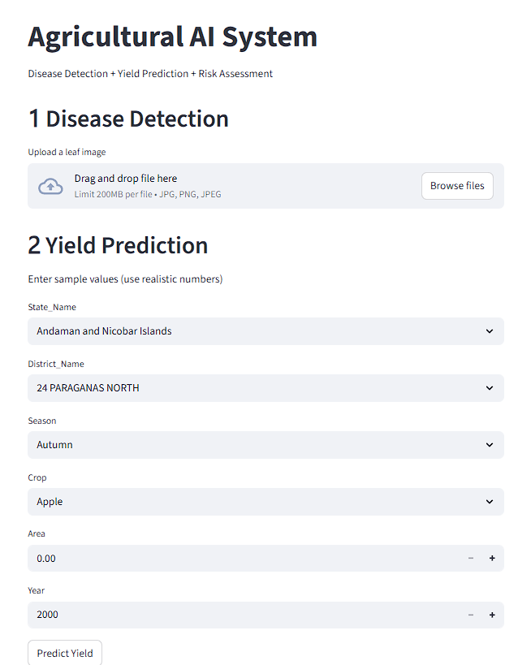
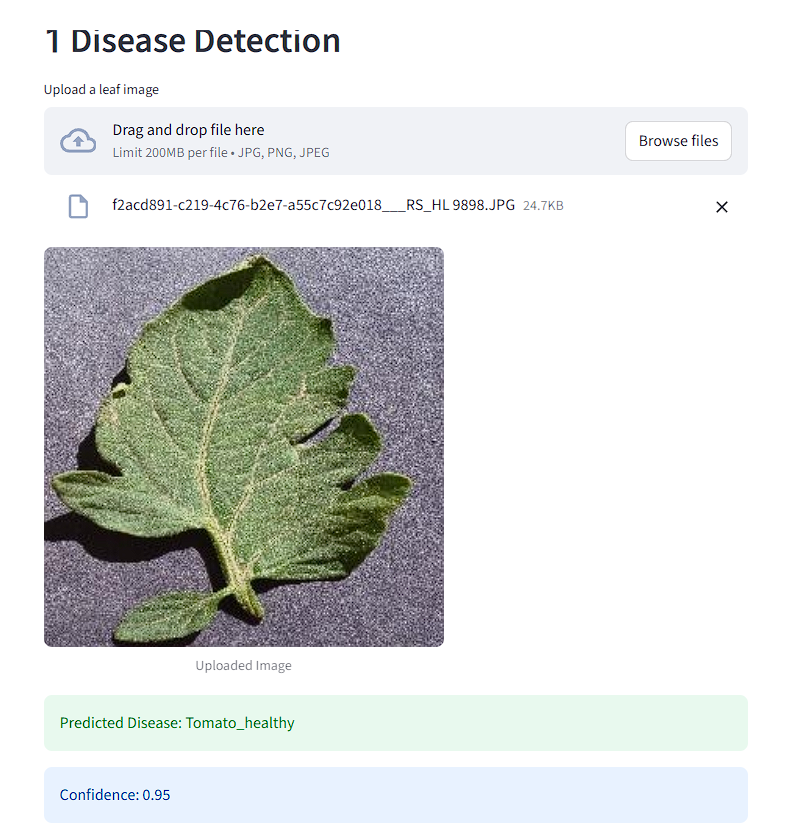
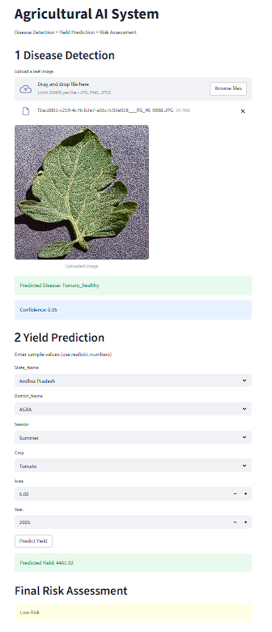

#  Multi-Crop Disease Detection and Yield Prediction System

##  Project Overview
This project is an AI-powered agricultural intelligence system that combines:
- Crop disease detection using deep learning
- Crop yield prediction using machine learning
- An interactive web dashboard for real-time predictions

The goal is to help farmers and agricultural stakeholders make data-driven decisions.


##  Problem Statement
Early detection of crop diseases and accurate yield prediction are major challenges in agriculture.
This system addresses both problems using Artificial Intelligence and Machine Learning.


##  Technologies Used
- Python
- TensorFlow / Keras
- Scikit-learn
- Streamlit
- Pandas, NumPy, Matplotlib


##  Dataset Information
- Disease Detection Dataset:
  - Leaf images of multiple crops
  - Healthy and diseased classes
- Yield Prediction Dataset:
  - Crop type
  - Rainfall
  - Temperature
  - Area of cultivation

Datasets were preprocessed, cleaned, and split into training and testing sets.


##  Disease Detection Module
- Input: Leaf images
- Model: CNN with Transfer Learning (MobileNetV2)
- Output: Disease class with confidence score

###  Model Selection (Disease Detection)
- MobileNetV2 was chosen because:
  - It is lightweight and efficient
  - Works well with limited computational resources
  - Provides high accuracy using transfer learning


##  Yield Prediction Module
- Input: Environmental and agricultural features
- Models used:
  - Random Forest
  - XGBoost
- Output: Predicted crop yield

- ###  Model Selection (Yield Prediction)
- Random Forest:
  - Handles non-linear data well
  - Robust to overfitting
- XGBoost:
  - High performance on tabular data
  - Captures complex feature interactions


---

##  Dashboard Features
- Upload leaf images for disease detection
- Crop yield prediction form
- Confidence scores for predictions
- Simple and interactive UI using Streamlit

---

##  Screenshots

### Complete Dashboard


### Disease Detection Result


### Yield Prediction Input


### Yield Prediction Result


### Final Risk Assessment


---

##  How to Run the Project
1. Clone the repository
```bash
git clone https://github.com/thennjan/multi-crop-agriculture-ai.git

pip install -r requirements.txt

streamlit run app/app.py

---

##  Results
- Disease Detection Accuracy: Approximately 90% on test data
- Yield Prediction:
  - Good R² score indicating strong predictive performance
  - Model captures relationships between environmental factors and yield


---

## 📁 Project Structure
